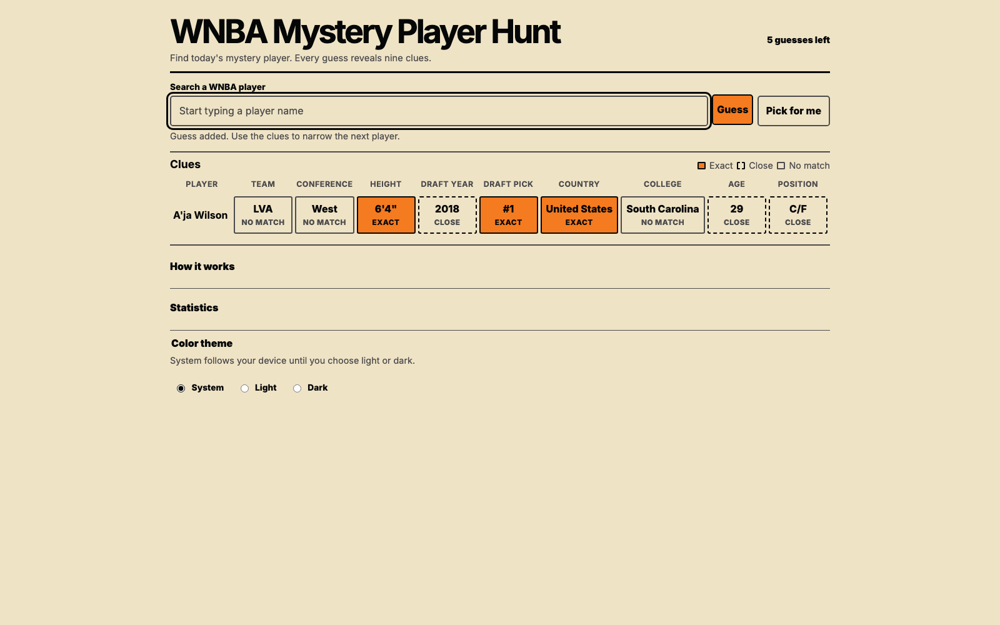

# WNBA Mystery Player Hunt

A daily WNBA player-guessing game for fans who want a quick, clue-driven challenge, using nine
comparisons to turn each of six guesses into a useful next move.

[Play the game](https://vosslab.github.io/wnba-mystery-player-hunt/) |
[View the repository](https://github.com/vosslab/wnba-mystery-player-hunt)

<!-- screenshots:begin (managed by screenshot-docs) -->

<!-- screenshots:end -->

## A daily clue chase

Each round asks for one mystery player. Search by two or more characters, submit a player, and
use the comparison grid to narrow the next guess. A finished round gives a spoiler-free share
summary and saves local statistics.

- Six guesses make the round short enough for a daily habit.
- Nine clues compare team, conference, height, draft year and pick, country, college, age, and
  position.
- Exact, close, and no-match feedback makes every row useful, including a wrong answer.
- Keyboard and mouse search, `Pick for me`, and light, dark, and system themes support a quick
  play session.
- The browser uses only bundled JSON; roster and statistic gathering stay in the separate Python
  maintenance workflow.

## Quick start

Install the TypeScript development dependencies, then build and serve the same static artifact
that the project prepares for GitHub Pages:

```bash
./devel/setup_typescript.sh
./run_web_server.sh
```

The terminal prints a local URL. Open it, type at least two characters of a player name, choose a
match, and make a guess.

For setup requirements and the optional Playwright browser installation, see
[docs/INSTALL.md](docs/INSTALL.md).

## Build and test

Build the distributable static site:

```bash
./build_github_pages.sh
```

Run the source-quality gate and the browser gameplay tests:

```bash
./check_codebase.sh
./run_playwright_tests.sh --build
```

The first command type-checks, lints, checks formatting, and runs Node behavior tests. The second
rebuilds the static site and exercises the browser game; install Playwright browsers first when
needed.

## How a round works

1. Enter at least two characters in the player search.
2. Select a suggestion and submit it, or use `Pick for me`.
3. Read all nine clue cells in the new row, then choose the next player.
4. Solve the mystery player within six guesses to win; otherwise see the answer after the final
   guess.

The game always uses the roster bundled in the repository. Data updates are independent Python
maintenance work; the browser never fetches roster or statistics data at runtime.

## Documentation

- [docs/INSTALL.md](docs/INSTALL.md) explains prerequisites, dependency installation, and build
  verification.
- [docs/USAGE.md](docs/USAGE.md) covers local play, game controls, and developer checks.
- [docs/DATA_REFRESH.md](docs/DATA_REFRESH.md) documents the two-stage Python-only refresh and
  explicit 200 or 300 fantasy-point review choices.
- [WNBA data-use posture](docs/active_plans/decisions/wnba_data_use.md) records the terms and
  permission decision that must be resolved before any public release using WNBA Stats data.
- [docs/active_plans/wnba_game-plan.md](docs/active_plans/wnba_game-plan.md) records the active
  implementation plan, including the Python-only data boundary and release-data requirements.

## Bundled roster

The browser uses the static roster committed with the game. Updating that file is an independent
Python maintenance task and is never required to start, build, or play the game.

## License

This repository is distributed under the [MIT License](LICENSE.MIT.md).
